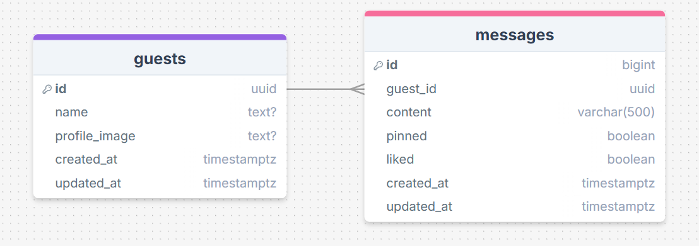

# Documentação de Infraestrutura e Integrações

Este documento reúne os passos essenciais para configurar o backend/infra do projeto (Supabase, OAuth, Webhooks e testes Deno). Coloque as credenciais em arquivos de ambiente (`.env.local`, `.env.test`) e nunca as comite.

## Sumário
- Supabase CLI e migrações
- Autenticação social (Google / GitHub) para o Guestbook
- Discord Webhook (notificações via Edge Function)
- Testes automatizados (Deno)

---

## 1. Supabase CLI e migrações

O projeto usa Supabase para banco, autenticação e Edge Functions. Arquivos relacionados estão em:

- [supabase/config.toml](./supabase/config.toml)
- [supabase/migrations](./supabase/migrations/)
- [supabase/functions](./supabase/functions/)

Comandos comuns (executar no root do repositório):

```bash
# intalar Supabase CLI
npm install supabase --save-dev

# autenticar o CLI (abre o navegador)
npx supabase login

# vincular ao projeto remoto
npx supabase link --project-ref <id-do-projeto>

# iniciar ambiente local (docker)
npx supabase start

# resetar banco local e aplicar migrations do zero
npx supabase db reset

# verificar status do ambiente local
npx supabase status

# enviar mudanças de migração para o remoto
npx supabase db push

# sincronizar schema remoto para local
npx supabase db pull
```

Observações:
- Use `--project-ref` com cuidado; verifique o id do projeto no painel Supabase.
- Variáveis sensíveis devem ficar em `.env.local` (não versionar).

---

## Schema das tabelas

As tabelas principais usadas pelo Guestbook estão definidas em `supabase/schema`.

- `guests` — armazena dados dos usuários autenticados (vindo do Auth).
- `messages` — mensagens do guestbook vinculadas a `guests`.

Segue imagem do schema das tabelas:



SQL (trechos relevantes):

```sql
-- guests
CREATE TABLE IF NOT EXISTS public.guests (
	id UUID REFERENCES auth.users ON DELETE CASCADE NOT NULL PRIMARY KEY,
	name TEXT,
	profile_image TEXT,
	created_at TIMESTAMP WITH TIME ZONE DEFAULT NOW() NOT NULL, 
	updated_at TIMESTAMP WITH TIME ZONE DEFAULT NOW() NOT NULL
);

-- messages
CREATE TABLE IF NOT EXISTS public.messages (
	id BIGINT GENERATED ALWAYS AS IDENTITY PRIMARY KEY,
	guest_id UUID REFERENCES public.guests(id) ON DELETE CASCADE NOT NULL,
	content VARCHAR(500) NOT NULL,
	pinned BOOLEAN DEFAULT FALSE NOT NULL,
	liked BOOLEAN DEFAULT FALSE NOT NULL,
	created_at TIMESTAMP WITH TIME ZONE DEFAULT NOW() NOT NULL,
	updated_at TIMESTAMP WITH TIME ZONE DEFAULT NOW() NOT NULL
);
```

Policies e triggers (resumo):

- Ambas as tabelas têm RLS ativado.
- `guests`: política de leitura pública e trigger que popula `guests` quando um novo `auth.users` é criado.
- `messages`: política pública de leitura; apenas usuários autenticados podem inserir mensagens onde `guest_id = auth.uid()`; apenas o dono pode atualizar/excluir suas mensagens.
- Trigger `on_message_activity_report` chama a função `notify_discord_on_message_activity` que utiliza `pg_net`/`net.http_post` para acionar a Edge Function de relatório para o Discord.

Para ver o SQL completo, consulte:

- [supabase/schema/01_guests.sql](../supabase/schema/01_guests.sql)
- [supabase/schema/02_messages.sql](../supabase/schema/02_messages.sql)


## 2. Autenticação Social (OAuth) — Guestbook

O Guestbook usa autenticação via Supabase (Providers). As credenciais obtidas no Google e GitHub devem ser inseridas no painel do Supabase (Authentication → Providers) ou como secrets.

### A. Google (Google Cloud Console)

1. Crie um projeto no Google Cloud Console.
2. Configure a Tela de Consentimento OAuth (app como Externo se necessário).
3. Em Credenciais → Create Credentials → OAuth client ID (Web application).
4. Em Authorized redirect URIs, adicione:

```
https://<id-do-projeto>.supabase.co/auth/v1/callback
```

5. Salve `Client ID` e `Client Secret` e registre-os no painel do Supabase.

### B. GitHub (OAuth App)

1. GitHub → Settings → Developer settings → OAuth Apps → New OAuth App.
2. Callback URL:

```
https://<id-do-projeto>.supabase.co/auth/v1/callback
```

3. Salve `Client ID` e `Client Secret` e adicione no painel do Supabase.

### C. No painel do Supabase

- Vá em `Authentication` → `Providers` e habilite Google e GitHub, preenchendo Client ID/Secret.
- Opcional: configurar `Redirect URLs` adicionais para ambientes locais (ver nota abaixo).

Nota para desenvolvimento local: para testar OAuth localmente, considere usar um túnel (ngrok) ou adicionar `http://localhost:3000` como redirect nas configurações dos provedores quando suportado.

---

## 3. Discord Webhook (notificações)

Usamos Database Webhooks + Edge Function `send-discord-report` para enviar notificações ao Discord quando mensagens são criadas/atualizadas.

1. Crie um Webhook no canal do Discord e copie a URL.
2. Defina o secret no Supabase (ou no CI) com:

```bash
npx supabase secrets set DISCORD_WEBHOOK_URL="https://discord.com/api/webhooks/...."
```

3. O trigger/trigger function no banco chama a Edge Function `send-discord-report` (veja [supabase/functions/send-discord-report](./supabase/functions/send-discord-report/index.ts)).

Observações:
- Teste o webhook manualmente antes de integrá-lo no fluxo de DB.
- Não exponha a URL do webhook publicamente.

---

## 4. Testes Automatizados (Deno)

Os testes das Edge Functions usam Deno. Execute com o ambiente local ativo (Supabase Docker) e usando o arquivo `.env.test`.

Comandos exemplares:

```bash
# criar/rodar testes específicos
deno test --allow-all --env-file=.env.test supabase/functions/tests/create-message_test.ts

deno test --allow-all --env-file=.env.test supabase/functions/tests/update-message_test.ts

deno test --allow-all --env-file=.env.test supabase/functions/tests/delete-message_test.ts

deno test --allow-all --env-file=.env.test supabase/functions/tests/send-discord-report_test.ts
```

Notas:
- `--allow-all` é conveniente para testes locais; em CI revise as permissões necessárias.
- Garanta que as variáveis de teste em `.env.test` apontem para o ambiente de teste correto.

---

## 5. Boas práticas e locais para documentação adicional

- Adicione credenciais apenas via secrets do Supabase ou variáveis de ambiente do CI.
- Documente qualquer alteração de triggers ou policies em `supabase/migrations`.
- Arquivos de função ficam em: [supabase/functions](./supabase/functions/)
- Para referência rápida do projeto, veja o [README principal](./README.md).


